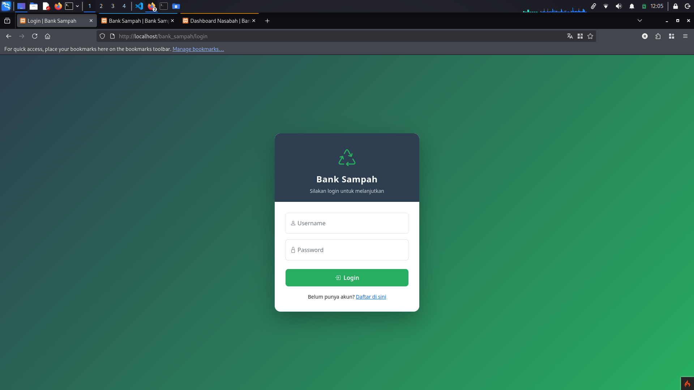
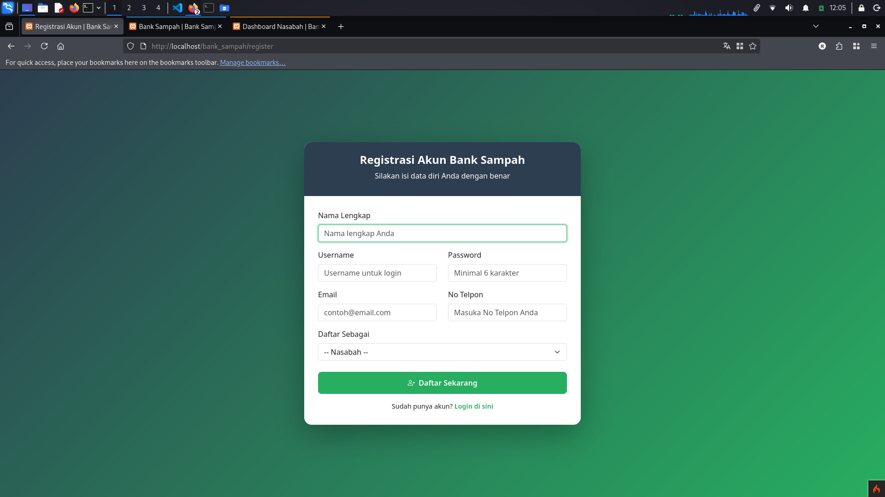
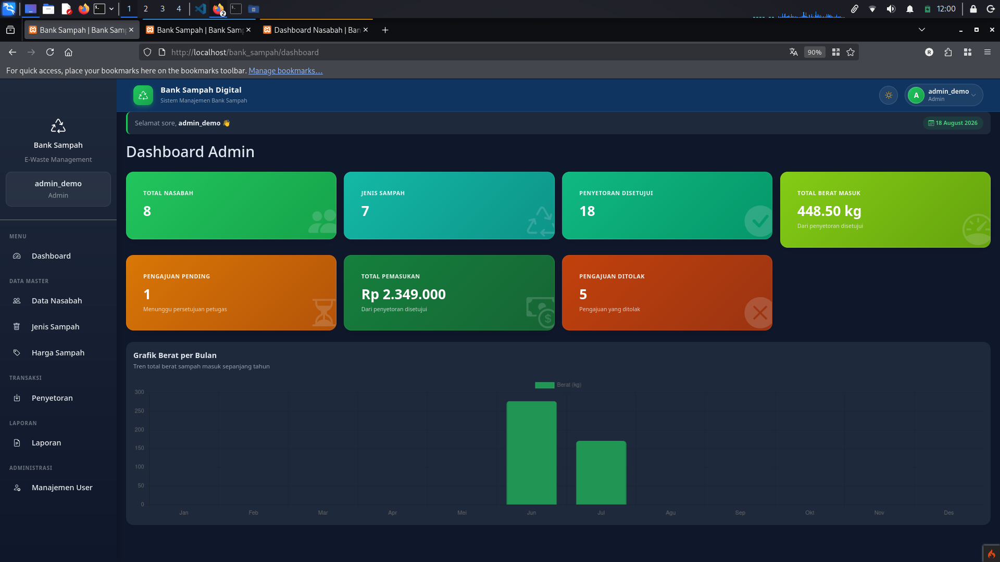
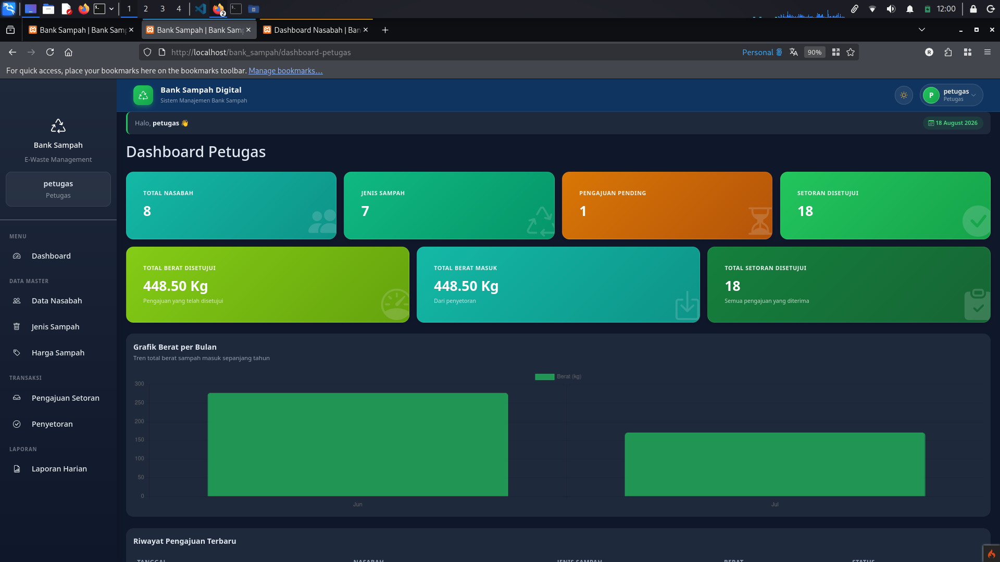
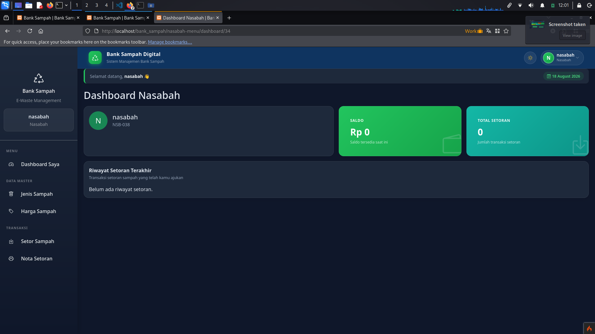

<div align="center">

# ♻️ Sistem Manajemen Bank Sampah Digital

**Aplikasi berbasis web untuk digitalisasi pengelolaan bank sampah** — mulai dari pencatatan setoran sampah, saldo tabungan nasabah, hingga laporan transaksi, dengan tiga peran pengguna: **Admin**, **Petugas**, dan **Nasabah**.


</div>

---

## 📖 Tentang Proyek

**Sistem Manajemen Bank Sampah Digital** dikembangkan sebagai proyek Ujian Akhir Semester (UAS) mata kuliah **Pemrograman Web Lanjut**. Aplikasi ini bertujuan membantu unit bank sampah dalam mengelola data nasabah, transaksi setoran sampah, dan saldo tabungan secara lebih rapi, transparan, dan efisien dibanding pencatatan manual.

Sistem ini dibangun dengan arsitektur **MVC** menggunakan framework **CodeIgniter 4**, dan mendukung tiga peran pengguna dengan hak akses yang berbeda.

## 👥 Peran Pengguna

| Peran          | Deskripsi Akses                                                                                                                                     |
| -------------- | --------------------------------------------------------------------------------------------------------------------------------------------------- |
| 🛡️ **Admin**  | Mengelola data master (jenis sampah & harga), mengelola akun petugas & nasabah, memantau seluruh transaksi, dan melihat laporan keseluruhan sistem. |
| 👷 **Petugas** | Mencatat transaksi setoran sampah milik nasabah, memperbarui saldo tabungan, dan mengelola data transaksi harian.                                   |
| 🙋 **Nasabah** | Melihat riwayat setoran sampah, memantau saldo tabungan pribadi, dan mengakses informasi transaksi miliknya.                                        |

## ✨ Fitur Utama

* 🔐 Autentikasi & manajemen sesi berbasis peran (*role-based access control*)
* 🧾 Pencatatan transaksi setoran sampah oleh petugas
* 💰 Pengelolaan saldo tabungan nasabah secara otomatis
* 📊 Dashboard ringkasan untuk masing-masing peran
* 📁 Manajemen data master jenis & harga sampah (Admin)
* 📜 Riwayat & histori transaksi per nasabah
* 📑 Laporan transaksi

## 🛠️ Teknologi yang Digunakan

* **Backend:** PHP, CodeIgniter 4
* **Frontend:** Bootstrap
* **Database:** MySQL (via XAMPP)
* **Tools:** Composer, XAMPP (Apache & MySQL)

## 🖼️ Tampilan Aplikasi

| Login                    | Register                       |
| ------------------------ | ------------------------------ |
|  |  |

| Dashboard Admin                             | Dashboard Petugas                               |
| ------------------------------------------- | ----------------------------------------------- |
|  |  |

| Dashboard Nasabah                               |
| ----------------------------------------------- |
|  |

---

## 🚀 Instalasi & Menjalankan Secara Lokal

### Prasyarat

* [XAMPP](https://www.apachefriends.org/) (PHP ≥ 8.1, MySQL)
* [Composer](https://getcomposer.org/)
* Git

### Langkah-langkah

1. **Clone repository**

   ```bash
   git clone https://github.com/rik0sec/bank-sampah-digital.git
   cd bank-sampah-digital
   ```

2. **Install dependency**

   ```bash
   composer install
   ```

3. **Konfigurasi environment**

   Buat file `.env` pada direktori utama project.

   Sesuaikan konfigurasi berikut di file `.env`:

   ```
   CI_ENVIRONMENT = development

   database.default.hostname = localhost
   database.default.database = bank_sampah
   database.default.username = root
   database.default.password =
   database.default.DBDriver = MySQLi
   ```

4. **Buat database**

   * Aktifkan **Apache** dan **MySQL** di XAMPP
   * Buat database baru bernama `bank_sampah` melalui phpMyAdmin
   * Import file `database/bank_sampah.sql` melalui tab **Import** di phpMyAdmin

5. **Jalankan server**

   Jika menggunakan XAMPP dan folder project ditempatkan di `htdocs` dengan nama `bank_sampah`, aplikasi dapat diakses melalui:

   ```
   http://localhost/bank_sampah
   ```

   Alternatif menggunakan server development CodeIgniter 4:

   ```bash
   php spark serve
   ```

   Kemudian akses:

   ```
   http://localhost:8080
   ```

## 🔑 Akun Demo

Aplikasi menyediakan akun demo untuk mencoba masing-masing role:

| Role           | Username  | Password    |
| -------------- | --------- | ----------- |
| 🛡️ **Admin**  | `admin`   | `Demo@2026` |
| 👷 **Petugas** | `petugas` | `Demo@2026` |
| 🙋 **Nasabah** | `nasabah` | `Demo@2026` |

> **Catatan:** Akun di atas digunakan untuk keperluan demo dan pengujian aplikasi. Jangan menggunakan kredensial demo untuk lingkungan production.

## 📂 Struktur Proyek

```
bank-sampah-digital/
├── app/            # Controller, Model, View, Config (logika utama aplikasi)
├── database/       # File database SQL
├── docs/           # Screenshot dan dokumentasi aplikasi
├── public/         # Entry point aplikasi (index.php, assets)
├── system/         # Core framework CodeIgniter 4
├── tests/          # Unit test
├── writable/       # Cache, log, upload file
└── README.md
```

## 👤 Author

Dikembangkan oleh **Riko Nugroho** sebagai proyek Ujian Akhir Semester — Mata Kuliah *Pemrograman Web Lanjut*, Semester 4.

* GitHub: [@rik0sec](https://github.com/rik0sec)

## 📄 Lisensi

Proyek ini menggunakan lisensi [MIT](LICENSE).
